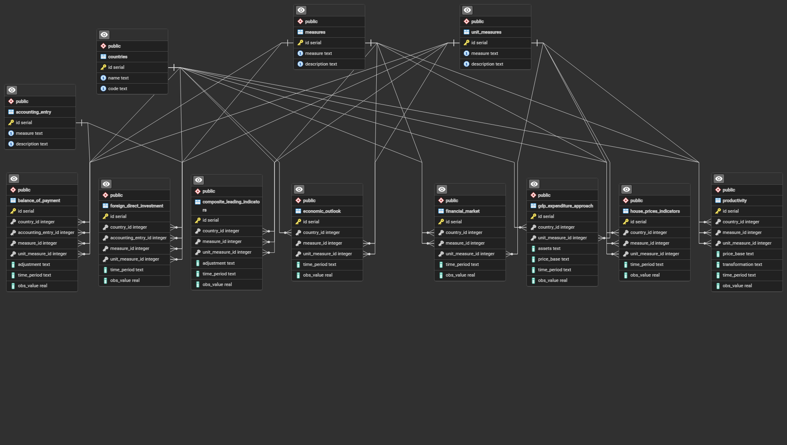

# Economy Database Design 

## Scope
This database serves as a centralized repository for economic data from various countries, providing organized and accessible information for analysis, research, and decision-making. Its structured design allows for efficient storage and retrieval of data, facilitating in-depth analysis of economic trends and patterns. Researchers, and analysts can utilize the database to conduct comparative studies, monitor economic health. It supports forecasting activities by offering historical data and aids in strategic planning by enabling international comparisons. Furthermore, the database has educational value, providing real-world examples for teaching economic principles and analysis techniques. 

The database covers a wide range of economic indicators and data related to various countries across the globe. It includes data on macroeconomic factors such as GDP, inflation rates, trade balances, and foreign direct investment. Additionally, it encompasses data on sector-specific indicators like productivity, house prices, and financial market performance. The scope also includes balance of payments data, economic outlooks, and composite leading indicators.

This database does not include personal financial data, detailed microeconomic information, non-economic data, real-time market data, geopolitical events beyond their economic impact, individual transactions, legal or regulatory information, predictive models, data from non-economic sources, individual demographics, or operational data specific to businesses.

## Functional Requirements

* CRUD operations for all tables
* Users should be able to input new data and update existing records easily.
* The database should enforce data integrity constraints to ensure the accuracy and consistency of the stored data.
* Input data should be validated to prevent errors and maintain data quality.

## Representation

Entities are captured in SQLite tables with the following schema.

### Entities

The database includes the following entities:

Sure, here's a description of all entities in the database, including column names, data types, and other relevant details:

#### 1. **countries**:
The `countries` table serves as a repository for individual countries' data within the database. It provides a comprehensive list of countries along with their unique identifiers and country codes. This table facilitates organizing and referencing country-specific information in various economic datasets.

#### 2. **measures**:
The `measures` table acts as a central repository for different measures used in economic analysis. Each measure is accompanied by a descriptive explanation of its meaning and usage. This table enables the association of specific measures with their respective datasets, providing clarity and consistency in data interpretation.

#### 3. **unit_measures**:
The `unit_measures` table contains a catalog of unit measures utilized in economic data representation. Each unit measure is accompanied by a descriptive explanation of its purpose and significance. This table aids in standardizing the units used across various economic indicators, ensuring uniformity and accuracy in data analysis.

#### 4. **accounting_entry**:
The `accounting_entry` table maintains a record of different types of accounting entries with corresponding descriptions. Each entry elucidates its purpose and relevance within economic data sets. This table assists in categorizing and organizing financial transactions or entries, facilitating accurate financial reporting and analysis.

#### 5. **balance_of_payment**:
The balance of payments is a statistical statement that provides a systematic summary of economic transactions of an economy with the rest of the world, for a specific time period. The transactions are for the most part between residents and non-residents of the economy. A transaction is defined as an economic flow that reflects the creation, transformation, exchange, transfer, or extinction of economic value and involves changes in ownership, of goods or assets, the provision of services, labour or capital. More information an be found [here](https://data-explorer.oecd.org/vis?fs[0]=Topic%2C0%7CEconomy%23ECO%23&fs[1]=Topic%2C1%7CEconomy%23ECO%23%7CBalance%20of%20payments%23ECO_BAL%23&pg=0&fc=Topic&snb=3&df[ds]=dsDisseminateFinalDMZ&df[id]=DSD_BOP%40DF_BOP&df[ag]=OECD.SDD.TPS&df[vs]=1.0&pd=%2C&dq=USA.....Q.XDC.Y&ly[rw]=MEASURE&ly[cl]=TIME_PERIOD&ly[rs]=ACCOUNTING_ENTRY&to[TIME_PERIOD]=false) 

#### 6. **economic_outlook**:
The Economic Outlook presents the OECD’s analysis of the major global economic trends and prospects for the next two years. The Outlook puts forward a consistent set of projections for output, employment, government spending, prices and current balances based on a review of each member country and of the induced effect on each of them on international developments. More details can be found [here](https://data-explorer.oecd.org/vis?fs[0]=Topic%2C0%7CEconomy%23ECO%23&fs[1]=Topic%2C1%7CEconomy%23ECO%23%7CEconomic%20outlook%23ECO_OUT%23&pg=0&fc=Topic&snb=2&df[ds]=dsDisseminateFinalDMZ&df[id]=DSD_EO%40DF_EO&df[ag]=OECD.ECO.MAD&df[vs]=1.1&pd=%2C&dq=.GDPV_ANNPCT.A&ly[rw]=REF_AREA&ly[cl]=TIME_PERIOD&ly[rs]=MEASURE&to[TIME_PERIOD]=false&si=2)

#### 7. **productivity**:
The Productivity table aims at providing users with the most comprehensive and the latest productivity estimates. The update cycle is on a rolling basis: each variable in the dataset is made publicly available as soon as it is updated in the sources databases. The productivity database contains data on labour productivity both measured using employment or hours worked and the compenents of capital and labour inputs. The productivity database in levels, in growth rates and by industry contains annual data, while the database on productivity and unit labour costs are quarterly estimates.
More details can be found [here](https://data-explorer.oecd.org/vis?fs[0]=Topic%2C0%7CEconomy%23ECO%23&fs[1]=Topic%2C1%7CEconomy%23ECO%23%7CProductivity%23ECO_PRO%23&pg=0&fc=Topic&snb=4&df[ds]=dsDisseminateFinalDMZ&df[id]=DSD_PDB%40DF_PDB_ULC_Q&df[ag]=OECD.SDD.TPS&df[vs]=1.0&pd=%2C&dq=.Q.......&ly[rw]=REF_AREA&ly[cl]=TIME_PERIOD&to[TIME_PERIOD]=false&si=0)


#### 8. **composite_leading_indicators**:
The composite leading indicator is a times series, formed by aggregating a variety of component indicators which show a reasonably consistent relationship with a reference series (e.g. industrial production IIP up to March 2012 and since then the reference series is GDP) at turning points. The OECD CLI is designed to provide qualitative information on short-term economic movements, especially at the turning points, rather than quantitative measures.
More details can be found [here](https://data-explorer.oecd.org/vis?fs[0]=Topic%2C0%7CEconomy%23ECO%23&fs[1]=Topic%2C1%7CEconomy%23ECO%23%7CLeading%20indicators%23ECO_LEA%23&pg=0&fc=Topic&snb=1&df[ds]=dsDisseminateFinalDMZ&df[id]=DSD_STES%40DF_CLI&df[ag]=OECD.SDD.STES&df[vs]=4.1&pd=%2C&dq=.M.LI...AA...H&ly[rw]=TIME_PERIOD&ly[cl]=REF_AREA&to[TIME_PERIOD]=false&si=0)

#### 9. **foreign_direct_investment**:
This FDI (foreign direct investments) flows by economic activity, BMD4 includes inward and outward Foreign Direct Investment (FDI) flows by economic activity for OECD reporting economies.
Inward FDI flows by economic activity measure the value of cross-border direct investment transactions received by the reporting economy in a specific industry during a year, enabling, for example, the identification of the most attractive industries for FDI in each OECD economy in that year.
Outward FDI flows by economic activity measure the value of cross-border direct investment transactions from the reporting economy during a year, by industry. The industry sector corresponds to the activity of the direct investment enterprise or to the activity of the direct investor (more details on the activity allocation method for outward FDI flows are indicated in the metadata information attached at the country level).
 More details can be found [here](https://data-explorer.oecd.org/vis?fs[0]=Topic%2C0%7CEconomy%23ECO%23&fs[1]=Topic%2C1%7CEconomy%23ECO%23%7CForeign%20direct%20investment%20%28FDI%29%23ECO_FDI%23&fs[2]=Topic%2C2%7CEconomy%23ECO%23%7CForeign%20direct%20investment%20%28FDI%29%23ECO_FDI%23%7CFDI%20financial%20flows%23ECO_FDI_FIF%23&pg=0&fc=Topic&snb=3&df[ds]=dsDisseminateFinalDMZ&df[id]=DSD_FDI%40DF_FDI_FLOW_IND&df[ag]=OECD.DAF.INV&df[vs]=1.0&pd=%2C&dq=ITA.T_FA_F.USD_EXC..NET_FDI....W.IMC._T%2BA_B%2BC%2BC10T12%2BC13T18X15%2BC19T22%2BC24T28X27%2BC29_30%2BC15_23_27_31T33%2BD%2BE%2BF%2BGTU%2BG%2BH%2BI%2BJ%2BK%2BL%2BM%2BN%2BO_T_U%2BP%2BQ%2BR%2BS%2B_X%2BPRV_RE.A.&to[TIME_PERIOD]=false&si=0&ly[rw]=ACTIVITY&ly[cl]=TIME_PERIOD%2CMEASURE_PRINCIPLE%2CTYPE_ENTITY)

#### 10. **house_prices_indicators**:
Residential Property Prices Indices (RPPIs) – also named House price indices (HPIs), are index numbers that measure the prices of residential properties over time. RPPIs are key statistics not only for citizens and households across the world, but also for economic and monetary policy makers. They can help, for example, to monitor potential macroeconomic imbalances and the risk exposure of the household and financial sectors.
More details can be found [here](https://data-explorer.oecd.org/vis?fs[0]=Topic%2C0%7CEconomy%23ECO%23&fs[1]=Topic%2C1%7CEconomy%23ECO%23%7CPrices%23ECO_PRI%23&pg=0&fc=Topic&snb=30&df[ds]=dsDisseminateFinalDMZ&df[id]=DSD_AN_HOUSE_PRICES%40DF_HOUSE_PRICES&df[ag]=OECD.ECO.MPD&df[vs]=1.0&pd=%2C&dq=.Q.RHP.&ly[rw]=REF_AREA&ly[cl]=TIME_PERIOD&to[TIME_PERIOD]=false&si=0)

#### 11. **gdp_expenditure_approach**:
This table presents Gross Domestic Product (GDP) and its components according to the expenditure approach. In the expenditure approach, the main components of GDP are: final consumption expenditure of households and non-profit institutions serving households (NPISH) plus final consumption expenditure of General Government plus gross fixed capital formation (or investment) plus net trade (exports minus imports). Data is presented for each country in national currency as well as in euros for the European Union and the euro area. Data is also presented converted to US dollars using both purchasing power parities and exchange rates.
More details can be found [here](https://data-explorer.oecd.org/vis?fs[0]=Topic%2C0%7CEconomy%23ECO%23&fs[1]=Topic%2C2%7CEconomy%23ECO%23%7CNational%20accounts%23ECO_NAD%23%7CGDP%20and%20non-financial%20accounts%23ECO_NAD_GNF%23&fs[2]=Topic%2C3%7CEconomy%23ECO%23%7CNational%20accounts%23ECO_NAD%23%7CGDP%20and%20non-financial%20accounts%23ECO_NAD_GNF%23%7CGDP%20and%20components%23ECO_NAD_GNF_GDP%23&pg=0&fc=Topic&snb=22&si=0&df[ds]=dsDisseminateFinalDMZ&df[id]=DSD_NAMAIN10%40DF_TABLE1_EXPENDITURE&df[ag]=OECD.SDD.NAD&df[vs]=1.0&pd=%2C&dq=A.AUS.......XDC.V..&to[TIME_PERIOD]=false)

#### 12. **financial_market**:
Financial Indicators aim to capture in quantitative terms an important but heterogeneous and fast evolving area. Key factors driving this change are: globalisation of the financial markets; maturing of national financial markets and therefore the structure of these markets required to service their needs; increased sophistication of the actors in these markets; rapid technological change; and evolving regulatory frameworks. Financial institutions react and adapt to these conditions by changing their strategies; by specialising, by diversifying or concentrating their activities, and by extending through mergers and acquisitions. As a consequence, there is almost constant evolution in the institutional structures in which financial markets operate.
More details can be found [here](https://data-explorer.oecd.org/vis?fs[0]=Topic%2C0%7CEconomy%23ECO%23&fs[1]=Topic%2C1%7CEconomy%23ECO%23%7CShort-term%20economic%20statistics%23ECO_STS%23&pg=0&fc=Topic&snb=50&df[ds]=dsDisseminateFinalDMZ&df[id]=DSD_STES%40DF_FINMARK&df[ag]=OECD.SDD.STES&df[vs]=4.0&pd=%2C&dq=AUS.M..PA.....&ly[rw]=MEASURE&ly[cl]=TIME_PERIOD&to[TIME_PERIOD]=false&si=0)


### Relationships

The below entity relationship diagram describes the relationships among the entities in the database.



As detailed by the diagram:

1. **Countries and Economic Data Tables:**
   - All economic data tables (such as Balance of Payment, Economic Outlook, Productivity, etc.) are associated with countries. Each table holds data specific to different economic aspects of each country. This implies a relationship where each country can have multiple entries in each economic data table.

2. **Measures and Economic Data Tables:**
   - The Measures table is associated with various economic data tables (Balance of Payment, Economic Outlook, Productivity, etc.). Each economic data table references the Measures table to describe the type of measure being recorded. This implies a relationship where each measure can be referenced by multiple entries in each economic data table.

3. **Unit Measures and Economic Data Tables:**
   - Similar to measures, the Unit Measures table is associated with various economic data tables. Each economic data table references the Unit Measures table to describe the unit of measure for the recorded data. This implies a relationship where each unit measure can be referenced by multiple entries in each economic data table.

4. **Accounting Entries and Economic Data Tables:**
   - The Accounting Entries table is associated with economic data tables that involve financial transactions or entries (such as Balance of Payment, Foreign Direct Investment, etc.). Each economic data table references the Accounting Entries table to describe the type of financial entry being recorded. This implies a relationship where each accounting entry can be referenced by multiple entries in each relevant economic data table.

## Optimizations

1. **bop_index (Balance of Payment Table):**
   - This index is designed to optimize queries on the Balance of Payment table.
   - Queries involving filtering or joining based on country_id, accounting_entry_id, measure_id, unit_measure_id, adjustment, and time_period will benefit from this index.
   - Example queries: 
     - Selecting balance of payment data for a specific country and time period.
     - Filtering balance of payment data based on a specific accounting entry or measure.

2. **eo_index (Economic Outlook Table):**
   - This index is useful for optimizing queries on the Economic Outlook table.
   - Queries involving filtering or joining based on country_id, measure_id, unit_measure_id, and time_period will benefit from this index.
   - Example queries:
     - Selecting economic outlook data for a specific country and time period.
     - Filtering economic outlook data based on a specific measure.

3. **productivity_index (Productivity Table):**
   - This index is designed to optimize queries on the Productivity table.
   - Queries involving filtering or joining based on country_id, measure_id, unit_measure_id, price_base, transformation, and time_period will benefit from this index.
   - Example queries:
     - Selecting productivity data for a specific country and time period.
     - Filtering productivity data based on a specific measure or price base.

4. **cli_index (Composite Leading Indicators Table):**
   - This index is useful for optimizing queries on the Composite Leading Indicators table.
   - Queries involving filtering or joining based on country_id, measure_id, unit_measure_id, adjustment, and time_period will benefit from this index.
   - Example queries:
     - Selecting composite leading indicators data for a specific country and time period.
     - Filtering composite leading indicators data based on a specific measure.

5. **fdi_index (Foreign Direct Investment Table):**
   - This index is designed to optimize queries on the Foreign Direct Investment table.
   - Queries involving filtering or joining based on country_id, measure_id, unit_measure_id, accounting_entry_id, and time_period will benefit from this index.
   - Example queries:
     - Selecting foreign direct investment data for a specific country and time period.
     - Filtering foreign direct investment data based on a specific measure or accounting entry.

6. **house_prices (House Prices Indicators Table):**
   - This index is useful for optimizing queries on the House Prices Indicators table.
   - Queries involving filtering or joining based on country_id, measure_id, unit_measure_id, and time_period will benefit from this index.
   - Example queries:
     - Selecting house prices indicators data for a specific country and time period.
     - Filtering house prices indicators data based on a specific measure.

7. **gdb_index2 (GDP Expenditure Approach Table):**
   - Two indexes are specified for the GDP Expenditure Approach table.
   - The first index on (country_id, unit_measure_id) is useful for queries involving specific countries and unit measures.
   - The second index on (assets, price_base, time_period) is useful for queries involving specific assets, price base, and time periods.

8. **fm_index (Financial Market Table):**
   - This index is designed to optimize queries on the Financial Market table.
   - Queries involving filtering or joining based on country_id, measure_id, unit_measure_id, and time_period will benefit from this index.
   - Example queries:
     - Selecting financial market data for a specific country and time period.
     - Filtering financial market data based on a specific measure.

## Example
If you want to recreate the database your self , you can either download the raw data for each table using link in the tables descriptions
Or you can use the preprosses data in `data.zip` file .

To use the database in this repository you can do the following 
```bash
$ zcat economy.dump.gz | sqlite3 economy.db
```
Then you can search for all indicators in alphabetical order used in this database as :
```bash
sqlite3 economy.db
sqlite> SELECT * FROM measures
   ...> ORDER BY description;
+-----+---------------+--------------------------------------------------------------+
| id  |    measure    |                         description                          |
+-----+---------------+--------------------------------------------------------------+
| 44  | EQPF          | Adjustment for the change in net equity of households in pen |
|     |               | sion fund reserves                                           |
+-----+---------------+--------------------------------------------------------------+
| 15  | BSII          | Balance of primary income (balance of payments basis)        |
+-----+---------------+--------------------------------------------------------------+
| 17  | BSIIQ         | Balance of primary income as a percent of GDP                |
+-----+---------------+--------------------------------------------------------------+
| 16  | BSIID         | Balance of primary income in USD (balance of payments basis) |
+-----+---------------+--------------------------------------------------------------+
| 115 | NTR           | Balance of secondary income (balance of payments basis)      |
+-----+---------------+--------------------------------------------------------------+
| 117 | NTRQ          | Balance of secondary income as a percent of GDP              |
+-----+---------------+--------------------------------------------------------------+
| 116 | NTRD          | Balance of secondary income in USD (balance of payments basi |
|     |               | s)                                                           |
+-----+---------------+--------------------------------------------------------------+
| 228 | LOCOAB        | Bank activity                                                |
+-----+---------------+--------------------------------------------------------------+
| 236 | LOCOBS        | Business situation                                           |
+-----+---------------+--------------------------------------------------------------+
| 237 | LOCOBU        | Capacity utilization tendency                                |
+-----+---------------+--------------------------------------------------------------+
| 13  | KA            | Capital account                                              |
+-----+---------------+--------------------------------------------------------------+
| 171 | TKTRG         | Capital tax and transfers receipts                           |
+-----+---------------+--------------------------------------------------------------+
| 170 | TKPG          | Capital transfers paid and other capital payments            |
+-----+---------------+--------------------------------------------------------------+
| 263 | LOCOVR        | Cars registrations or sales                                  |
+-----+---------------+--------------------------------------------------------------+
| 93  | IRCB          | Central bank key interest rate                               |
+-----+---------------+--------------------------------------------------------------+
| 39  | CQ_ISKV       | Change in inventories, contributions to changes in real GDP  |
+-----+---------------+--------------------------------------------------------------+
| 184 | WSSH          | Compensation of employees received by households             |
+-----+---------------+--------------------------------------------------------------+
| 185 | WSSS          | Compensation of employees, total economy                     |
+-----+---------------+--------------------------------------------------------------+
| 186 | WSST          | Compensation rate, total economy                             |
+-----+---------------+--------------------------------------------------------------+
| 145 | PXC           | Competitors' price of goods and services exports             |
+-----+---------------+--------------------------------------------------------------+
| 146 | PXCX          | Competitors' price of non-commodity goods and services expor |
|     |               | ts                                                           |
+-----+---------------+--------------------------------------------------------------+
| 225 | BCICP         | Composite business confidence                                |
+-----+---------------+--------------------------------------------------------------+
| 226 | CCICP         | Composite consumer confidence                                |
+-----+---------------+--------------------------------------------------------------+
| 227 | LI            | Composite leading indicator (CLI)                            |
+-----+---------------+--------------------------------------------------------------+
| 240 | LOCODW        | Construction                                                 |
+-----+---------------+--------------------------------------------------------------+
| 239 | LOCOCI        | Consumer confidence                                          |
+-----+---------------+--------------------------------------------------------------+
| 31  | CPI           | Consumer price index                                         |
+-----+---------------+--------------------------------------------------------------+
| 33  | CPIH          | Consumer price index, harmonised                             |
+-----+---------------+--------------------------------------------------------------+
| 250 | LOCOPC        | Consumer prices                                              |
+-----+---------------+--------------------------------------------------------------+
| 40  | CTGSVD        | Contribution to world trade growth, goods and services (in U |
|     |               | SD, OECD reference year prices)                              |
+-----+---------------+--------------------------------------------------------------+
| 122 | PCORE_YTYPCT  | Core inflation                                               |
+-----+---------------+--------------------------------------------------------------+
| 119 | PCORE         | Core inflation index                                         |
+-----+---------------+--------------------------------------------------------------+
| 120 | PCOREH        | Core inflation index, harmonised                             |
+-----+---------------+--------------------------------------------------------------+
| 1   | CA            | Current account                                              |
+-----+---------------+--------------------------------------------------------------+
| 19  | CB            | Current account balance                                      |
+-----+---------------+--------------------------------------------------------------+
| 21  | CBGDPR        | Current account balance as a percentage of GDP               |
+-----+---------------+--------------------------------------------------------------+
| 20  | CBD           | Current account balance in USD                               |
+-----+---------------+--------------------------------------------------------------+
| 23  | CBRD          | Current account balance in USD, residual item                |
+-----+---------------+--------------------------------------------------------------+
| 22  | CBR           | Current account balance, residual item                       |
+-----+---------------+--------------------------------------------------------------+
| 204 | YPG           | Current disbursements of general government                  |
+-----+---------------+--------------------------------------------------------------+
| 205 | YPGQ          | Current disbursements of general government as a percentage  |
|     |               | of GDP                                                       |
+-----+---------------+--------------------------------------------------------------+
| 208 | YPGX          | Current disbursements of general government excluding gross  |
|     |               | interest payments                                            |
+-----+---------------+--------------------------------------------------------------+
| 209 | YPH           | Current disbursements of households and non-profit instituti |
|     |               | ons serving households                                       |
+-----+---------------+--------------------------------------------------------------+
| 212 | YRG           | Current receipts of general government                       |
+-----+---------------+--------------------------------------------------------------+
| 213 | YRGQ          | Current receipts of general government as a percentage of GD |
|     |               | P                                                            |
+-----+---------------+--------------------------------------------------------------+
| 216 | YRGX          | Current receipts of general government excluding gross inter |
|     |               | est receipts                                                 |
+-----+---------------+--------------------------------------------------------------+
| 230 | LOCOBD        | Demand or orders inflow tendency                             |
+-----+---------------+--------------------------------------------------------------+
| 42  | EE            | Dependent employment, total economy                          |
+-----+---------------+--------------------------------------------------------------+
| 4   | FA_D_F        | Direct investment                                            |
+-----+---------------+--------------------------------------------------------------+
| 176 | TYB           | Direct taxes on business                                     |
+-----+---------------+--------------------------------------------------------------+
| 177 | TYH           | Direct taxes on households                                   |
+-----+---------------+--------------------------------------------------------------+
| 173 | TRPESH        | Employees and self-employed contributions to social security |
+-----+---------------+--------------------------------------------------------------+
| 231 | LOCOBE        | Employment tendency                                          |
+-----+---------------+--------------------------------------------------------------+
| 41  | ECSA          | Employment, country specific                                 |
+-----+---------------+--------------------------------------------------------------+
| 242 | LOCOEX        | Exchange rate                                                |
+-----+---------------+--------------------------------------------------------------+
| 49  | EXCH          | Exchange rate, USD per national currency                     |
+-----+---------------+--------------------------------------------------------------+
| 52  | EXCHUD        | Exchange rate, national currency per USD                     |
+-----+---------------+--------------------------------------------------------------+
| 192 | XMKT          | Export market for goods and services, volume in USD          |
+-----+---------------+--------------------------------------------------------------+
| 238 | LOCOBX        | Export orders tendency                                       |
+-----+---------------+--------------------------------------------------------------+
| 193 | XPERF         | Export performance for goods and services, volume            |
+-----+---------------+--------------------------------------------------------------+
| 194 | XPERF_ANNPCT  | Export performance for goods and services, volume, growth    |
+-----+---------------+--------------------------------------------------------------+
| 262 | LOCOTX        | Exports                                                      |
+-----+---------------+--------------------------------------------------------------+
| 148 | PXGSD         | Exports of goods and services in USD, deflator (national acc |
|     |               | ounts basis)                                                 |
+-----+---------------+--------------------------------------------------------------+
| 147 | PXGS          | Exports of goods and services, deflator (national accounts b |
|     |               | asis)                                                        |
+-----+---------------+--------------------------------------------------------------+
| 187 | XGS           | Exports of goods and services, nominal value (national accou |
|     |               | nts basis)                                                   |
+-----+---------------+--------------------------------------------------------------+
| 188 | XGSD          | Exports of goods and services, nominal value in USD (nationa |
|     |               | l accounts basis)                                            |
+-----+---------------+--------------------------------------------------------------+
| 189 | XGSV          | Exports of goods and services, volume (national accounts bas |
|     |               | is)                                                          |
+-----+---------------+--------------------------------------------------------------+
| 190 | XGSVD         | Exports of goods and services, volume in USD (national accou |
|     |               | nts basis)                                                   |
+-----+---------------+--------------------------------------------------------------+
| 191 | XGSV_ANNPCT   | Exports of goods and services, volume, growth (national acco |
|     |               | unts basis)                                                  |
+-----+---------------+--------------------------------------------------------------+
| 268 | T_FA_FL       | FDI financial flows - debt                                   |
+-----+---------------+--------------------------------------------------------------+
| 266 | T_FA_F5A      | FDI financial flows - equity (excluding reinvestment of earn |
|     |               | ings)                                                        |
+-----+---------------+--------------------------------------------------------------+
| 267 | T_FA_F5B      | FDI financial flows - reinvestment of earnings               |
+-----+---------------+--------------------------------------------------------------+
| 265 | T_FA_F        | FDI financial flows - total                                  |
+-----+---------------+--------------------------------------------------------------+
| 126 | PFDD          | Final domestic expenditure, deflator                         |
+-----+---------------+--------------------------------------------------------------+
| 56  | FDD           | Final domestic expenditure, nominal value                    |
+-----+---------------+--------------------------------------------------------------+
| 57  | FDDV          | Final domestic expenditure, volume                           |
+-----+---------------+--------------------------------------------------------------+
| 58  | FDDV_ANNPCT   | Final domestic expenditure, volume, growth                   |
+-----+---------------+--------------------------------------------------------------+
| 3   | FA            | Financial account                                            |
+-----+---------------+--------------------------------------------------------------+
| 5   | FA_F_F7       | Financial derivatives                                        |
+-----+---------------+--------------------------------------------------------------+
| 232 | LOCOBF        | Finished goods stocks tendency                               |
+-----+---------------+--------------------------------------------------------------+
| 87  | ICSA          | Fixed investment, country specific, volume                   |
+-----+---------------+--------------------------------------------------------------+
| 222 | GDPEMP        | GDP per person employed                                      |
+-----+---------------+--------------------------------------------------------------+
| 24  | CFKG          | General government consumption of fixed capital              |
+-----+---------------+--------------------------------------------------------------+
| 43  | EG            | General government employment                                |
+-----+---------------+--------------------------------------------------------------+
| 26  | CGAA          | General government final consumption expenditure, nominal va |
|     |               | lue, appropriation account                                   |
+-----+---------------+--------------------------------------------------------------+
| 132 | PIGAA         | General government fixed capital formation, deflator, based  |
|     |               | on appropriation account                                     |
+-----+---------------+--------------------------------------------------------------+
| 88  | IGAA          | General government fixed capital formation, nominal value, a |
|     |               | ppropriation account                                         |
+-----+---------------+--------------------------------------------------------------+
| 73  | GFAR          | General government gross financial assets as a percentage of |
|     |               |  GDP                                                         |
+-----+---------------+--------------------------------------------------------------+
| 74  | GGFL          | General government gross financial liabilities               |
+-----+---------------+--------------------------------------------------------------+
| 75  | GGFLQ         | General government gross financial liabilities as a percenta |
|     |               | ge of GDP                                                    |
+-----+---------------+--------------------------------------------------------------+
| 78  | GNFL          | General government net financial liabilities                 |
+-----+---------------+--------------------------------------------------------------+
| 79  | GNFLQ         | General government net financial liabilities as a percentage |
|     |               |  of GDP                                                      |
+-----+---------------+--------------------------------------------------------------+
| 111 | NLG           | General government net lending                               |
+-----+---------------+--------------------------------------------------------------+
| 112 | NLGQ          | General government net lending as a percentage of GDP        |
+-----+---------------+--------------------------------------------------------------+
| 113 | NLGX          | General government primary balance                           |
+-----+---------------+--------------------------------------------------------------+
| 114 | NLGXQ         | General government primary balance as a percentage of GDP    |
+-----+---------------+--------------------------------------------------------------+
| 9   | G             | Goods                                                        |
+-----+---------------+--------------------------------------------------------------+
| 167 | TGSVD         | Goods and services trade, volume in USD                      |
+-----+---------------+--------------------------------------------------------------+
| 168 | TGSVD_ANNPCT  | Goods and services trade, volume in USD, growth              |
+-----+---------------+--------------------------------------------------------------+
| 118 | PCG           | Government final consumption expenditure, deflator           |
+-----+---------------+--------------------------------------------------------------+
| 25  | CG            | Government final consumption expenditure, nominal value, GDP |
|     |               |  expenditure approach                                        |
+-----+---------------+--------------------------------------------------------------+
| 27  | CGV           | Government final consumption expenditure, volume             |
+-----+---------------+--------------------------------------------------------------+
| 28  | CGV_ANNPCT    | Government final consumption expenditure, volume, growth     |
+-----+---------------+--------------------------------------------------------------+
| 89  | IGV           | Government gross fixed capital formation, volume             |
+-----+---------------+--------------------------------------------------------------+
| 134 | PITISK        | Gross capital formation, deflator                            |
+-----+---------------+--------------------------------------------------------------+
| 98  | ITISK         | Gross capital formation, total, nominal value                |
+-----+---------------+--------------------------------------------------------------+
| 99  | ITISKV        | Gross capital formation, total, volume                       |
+-----+---------------+--------------------------------------------------------------+
| 218 | YRH_G         | Gross current receipts of households and non-profit institut |
|     |               | ions serving households                                      |
+-----+---------------+--------------------------------------------------------------+
| 197 | YDH_G         | Gross disposable income of household and non-profit institut |
|     |               | ions serving households                                      |
+-----+---------------+--------------------------------------------------------------+
| 69  | GDPV_CAP      | Gross domestic product per capita, volume                    |
+-----+---------------+--------------------------------------------------------------+
| 67  | GDPVD_CAP     | Gross domestic product per capita, volume in USD, at constan |
|     |               | t purchasing power parities                                  |
+-----+---------------+--------------------------------------------------------------+
| 127 | PGDP          | Gross domestic product, market prices, deflator              |
+-----+---------------+--------------------------------------------------------------+
| 130 | PGDP_ANNPCT   | Gross domestic product, market prices, deflator, growth      |
+-----+---------------+--------------------------------------------------------------+
| 72  | GDP_USD       | Gross domestic product, nominal value in USD, constant excha |
|     |               | nge rates                                                    |
+-----+---------------+--------------------------------------------------------------+
| 71  | GDP_ANNPCT    | Gross domestic product, nominal value, growth                |
+-----+---------------+--------------------------------------------------------------+
| 59  | GDP           | Gross domestic product, nominal value, market prices         |
+-----+---------------+--------------------------------------------------------------+
| 66  | GDPVD         | Gross domestic product, volume in USD, at constant purchasin |
|     |               | g power parities                                             |
+-----+---------------+--------------------------------------------------------------+
| 70  | GDPV_USD      | Gross domestic product, volume in USD, constant exchange rat |
|     |               | es                                                           |
+-----+---------------+--------------------------------------------------------------+
| 65  | GDPVCSA       | Gross domestic product, volume, country specific             |
+-----+---------------+--------------------------------------------------------------+
| 68  | GDPV_ANNPCT   | Gross domestic product, volume, growth                       |
+-----+---------------+--------------------------------------------------------------+
| 64  | GDPV          | Gross domestic product, volume, market prices                |
+-----+---------------+--------------------------------------------------------------+
| 91  | IOBV          | Gross fixed capital formation of private non-residential ind |
|     |               | ustry excluding shipping and oil, volume                     |
+-----+---------------+--------------------------------------------------------------+
| 92  | IOILV         | Gross fixed capital formation of the oil industry, volume    |
+-----+---------------+--------------------------------------------------------------+
| 96  | ISHV          | Gross fixed capital formation of the shipping industry, volu |
|     |               | me                                                           |
+-----+---------------+--------------------------------------------------------------+
| 90  | IHV           | Gross fixed capital formation, housing, volume               |
+-----+---------------+--------------------------------------------------------------+
| 97  | IT            | Gross fixed capital formation, total, nominal value          |
+-----+---------------+--------------------------------------------------------------+
| 100 | ITV           | Gross fixed capital formation, total, volume                 |
+-----+---------------+--------------------------------------------------------------+
| 101 | ITV_ANNPCT    | Gross fixed capital formation, total, volume, growth         |
+-----+---------------+--------------------------------------------------------------+
| 76  | GGINTP        | Gross general government interest payments                   |
+-----+---------------+--------------------------------------------------------------+
| 77  | GGINTR        | Gross general government interest receipts                   |
+-----+---------------+--------------------------------------------------------------+
| 131 | PGNP          | Gross national product, market prices, deflator              |
+-----+---------------+--------------------------------------------------------------+
| 82  | GNP           | Gross national product, nominal value, market prices         |
+-----+---------------+--------------------------------------------------------------+
| 83  | GNPV          | Gross national product, volume, market prices                |
+-----+---------------+--------------------------------------------------------------+
| 156 | SAVH_G        | Gross saving of households and non-profit institutions servi |
|     |               | ng households                                                |
+-----+---------------+--------------------------------------------------------------+
| 159 | SRATIO_G      | Gross saving ratio of households and non-profit institutions |
|     |               |  serving households                                          |
+-----+---------------+--------------------------------------------------------------+
| 221 | YSE_G         | Gross self-employment income received by households          |
+-----+---------------+--------------------------------------------------------------+
| 133 | PIT           | Gross total fixed capital formation, deflator                |
+-----+---------------+--------------------------------------------------------------+
| 121 | PCOREH_YTYPCT | Harmonised core inflation                                    |
+-----+---------------+--------------------------------------------------------------+
| 34  | CPIH_YTYPCT   | Harmonised headline inflation                                |
+-----+---------------+--------------------------------------------------------------+
| 35  | CPI_YTYPCT    | Headline inflation                                           |
+-----+---------------+--------------------------------------------------------------+
| 243 | LOCOHS        | Hours                                                        |
+-----+---------------+--------------------------------------------------------------+
| 84  | HRS           | Hours worked per worker, total economy                       |
+-----+---------------+--------------------------------------------------------------+
| 280 | IRSTCI        | Immediate interest rates, call money, interbank rate         |
+-----+---------------+--------------------------------------------------------------+
| 109 | MPEN          | Import penetration, goods and services                       |
+-----+---------------+--------------------------------------------------------------+
| 261 | LOCOTM        | Imports                                                      |
+-----+---------------+--------------------------------------------------------------+
| 247 | LOCOMG        | Imports of goods                                             |
+-----+---------------+--------------------------------------------------------------+
| 136 | PMGSD         | Imports of goods and services in USD, deflator (national acc |
|     |               | ounts basis)                                                 |
+-----+---------------+--------------------------------------------------------------+
| 135 | PMGS          | Imports of goods and services, deflator (national accounts b |
|     |               | asis)                                                        |
+-----+---------------+--------------------------------------------------------------+
| 104 | MGS           | Imports of goods and services, nominal value (national accou |
|     |               | nts basis)                                                   |
+-----+---------------+--------------------------------------------------------------+
| 105 | MGSD          | Imports of goods and services, nominal value in USD (nationa |
|     |               | l accounts basis)                                            |
+-----+---------------+--------------------------------------------------------------+
| 106 | MGSV          | Imports of goods and services, volume (national accounts bas |
|     |               | is)                                                          |
+-----+---------------+--------------------------------------------------------------+
| 107 | MGSVD         | Imports of goods and services, volume in USD (national accou |
|     |               | nts basis)                                                   |
+-----+---------------+--------------------------------------------------------------+
| 108 | MGSV_ANNPCT   | Imports of goods and services, volume, growth (national acco |
|     |               | unts basis)                                                  |
+-----+---------------+--------------------------------------------------------------+
| 32  | CPIDR         | Indicator of competitiveness based on relative consumer pric |
|     |               | es                                                           |
+-----+---------------+--------------------------------------------------------------+
| 179 | ULCDR         | Indicator of competitiveness based on relative unit labour c |
|     |               | osts in total economy                                        |
+-----+---------------+--------------------------------------------------------------+
| 256 | LOCOSI        | Interest rate spread                                         |
+-----+---------------+--------------------------------------------------------------+
| 244 | LOCOIS        | Inventories to shipments                                     |
+-----+---------------+--------------------------------------------------------------+
| 241 | LOCOEM        | Labour                                                       |
+-----+---------------+--------------------------------------------------------------+
| 223 | LCEMP         | Labour compensation per employee                             |
+-----+---------------+--------------------------------------------------------------+
| 102 | LF            | Labour force                                                 |
+-----+---------------+--------------------------------------------------------------+
| 103 | LFPR1574      | Labour force participation rate, as a percentage of populati |
|     |               | on aged 15-74                                                |
+-----+---------------+--------------------------------------------------------------+
| 125 | PDTY          | Labour productivity, total economy                           |
+-----+---------------+--------------------------------------------------------------+
| 245 | LOCOLT        | Long-term interest rate                                      |
+-----+---------------+--------------------------------------------------------------+
| 94  | IRL           | Long-term interest rate on government bonds                  |
+-----+---------------+--------------------------------------------------------------+
| 279 | IRLT          | Long-term interest rates                                     |
+-----+---------------+--------------------------------------------------------------+
| 60  | GDPML         | Mainland gross domestic product , nominal value, market pric |
|     |               | es                                                           |
+-----+---------------+--------------------------------------------------------------+
| 128 | PGDPML        | Mainland gross domestic product, market prices, deflator     |
+-----+---------------+--------------------------------------------------------------+
| 61  | GDPMLV        | Mainland gross domestic product, volume, market prices       |
+-----+---------------+--------------------------------------------------------------+
| 246 | LOCOMA        | Monetary aggregates                                          |
+-----+---------------+--------------------------------------------------------------+
| 18  | CAPOG         | Net capital outlays of the government                        |
+-----+---------------+--------------------------------------------------------------+
| 217 | YRH           | Net current receipts of households and non-profit institutio |
|     |               | ns serving households                                        |
+-----+---------------+--------------------------------------------------------------+
| 196 | YDH           | Net disposable income of households and non-profit instituti |
|     |               | ons serving households                                       |
+-----+---------------+--------------------------------------------------------------+
| 2   | EO            | Net errors and omissions                                     |
+-----+---------------+--------------------------------------------------------------+
| 55  | FBGSQ         | Net exports of goods and services as a percent of GDP        |
+-----+---------------+--------------------------------------------------------------+
| 53  | FBGS          | Net exports of goods and services, nominal value (national a |
|     |               | ccounts basis)                                               |
+-----+---------------+--------------------------------------------------------------+
| 54  | FBGSD         | Net exports of goods and services, nominal value in USD (nat |
|     |               | ional accounts basis)                                        |
+-----+---------------+--------------------------------------------------------------+
| 10  | G2            | Net exports of goods under merchanting                       |
+-----+---------------+--------------------------------------------------------------+
| 38  | CQ_FBGSV      | Net exports, contributions to changes in real GDP            |
+-----+---------------+--------------------------------------------------------------+
| 80  | GNINTP        | Net general government interest payments                     |
+-----+---------------+--------------------------------------------------------------+
| 81  | GNINTQ        | Net general government interest payments as a percentage of  |
|     |               | GDP                                                          |
+-----+---------------+--------------------------------------------------------------+
| 154 | SAVG          | Net general government saving                                |
+-----+---------------+--------------------------------------------------------------+
| 155 | SAVH          | Net saving of households and non-profit institutions serving |
|     |               |  households                                                  |
+-----+---------------+--------------------------------------------------------------+
| 158 | SRATIO        | Net saving ratio of households and non-profit institutions s |
|     |               | erving households                                            |
+-----+---------------+--------------------------------------------------------------+
| 220 | YSE           | Net self-employment income received by households            |
+-----+---------------+--------------------------------------------------------------+
| 248 | LOCONT        | Net trade                                                    |
+-----+---------------+--------------------------------------------------------------+
| 50  | EXCHEB        | Nominal effective exchange rate, chain-linked, overall weigh |
|     |               | ts                                                           |
+-----+---------------+--------------------------------------------------------------+
| 276 | CC            | Nominal exchange rates                                       |
+-----+---------------+--------------------------------------------------------------+
| 269 | HPI           | Nominal house price indices                                  |
+-----+---------------+--------------------------------------------------------------+
| 129 | PGDPOFS       | Offshore gross domestic product, market prices, deflator     |
+-----+---------------+--------------------------------------------------------------+
| 62  | GDPOFS        | Offshore gross domestic product, nominal value, market price |
|     |               | s                                                            |
+-----+---------------+--------------------------------------------------------------+
| 63  | GDPOFSV       | Offshore gross domestic product, volume, market prices       |
+-----+---------------+--------------------------------------------------------------+
| 234 | LOCOBO        | Order books tendency                                         |
+-----+---------------+--------------------------------------------------------------+
| 249 | LOCOOD        | Orders                                                       |
+-----+---------------+--------------------------------------------------------------+
| 211 | YPOTH         | Other current income payable by households and non-profit in |
|     |               | stitutions serving households                                |
+-----+---------------+--------------------------------------------------------------+
| 219 | YROTH         | Other current income received by households and non-profit i |
|     |               | nstitutions serving households                               |
+-----+---------------+--------------------------------------------------------------+
| 210 | YPOTG         | Other current outlays of general government                  |
+-----+---------------+--------------------------------------------------------------+
| 172 | TOCR          | Other current receipts of general government                 |
+-----+---------------+--------------------------------------------------------------+
| 6   | FA_O_F        | Other investment                                             |
+-----+---------------+--------------------------------------------------------------+
| 7   | FA_P_F        | Portfolio investment                                         |
+-----+---------------+--------------------------------------------------------------+
| 150 | PXNW          | Price of commodity exports                                   |
+-----+---------------+--------------------------------------------------------------+
| 138 | PMNW          | Price of commodity imports                                   |
+-----+---------------+--------------------------------------------------------------+
| 149 | PXGSX         | Price of non-commodity exports of goods and services         |
+-----+---------------+--------------------------------------------------------------+
| 137 | PMGSX         | Price of non-commodity imports of goods and services         |
+-----+---------------+--------------------------------------------------------------+
| 272 | HPI_YDH       | Price to income ratio                                        |
+-----+---------------+--------------------------------------------------------------+
| 270 | HPI_RPI       | Price to rent ratio                                          |
+-----+---------------+--------------------------------------------------------------+
| 233 | LOCOBI        | Prices expectations                                          |
+-----+---------------+--------------------------------------------------------------+
| 11  | IN1           | Primary income                                               |
+-----+---------------+--------------------------------------------------------------+
| 123 | PCP           | Private final consumption expenditure, deflator              |
+-----+---------------+--------------------------------------------------------------+
| 124 | PCP_YTYPCT    | Private final consumption expenditure, deflator, growth      |
+-----+---------------+--------------------------------------------------------------+
| 29  | CP            | Private final consumption expenditure, nominal value, GDP ex |
|     |               | penditure approach                                           |
+-----+---------------+--------------------------------------------------------------+
| 30  | CPAA          | Private final consumption expenditure, nominal value, approp |
|     |               | riation account                                              |
+-----+---------------+--------------------------------------------------------------+
| 36  | CPV           | Private final consumption expenditure, volume                |
+-----+---------------+--------------------------------------------------------------+
| 37  | CPV_ANNPCT    | Private final consumption expenditure, volume, growth        |
+-----+---------------+--------------------------------------------------------------+
| 85  | IBGV          | Private non-residential and government fixed capital formati |
|     |               | on, volume                                                   |
+-----+---------------+--------------------------------------------------------------+
| 86  | IBV           | Private non-residential gross fixed capital formation, volum |
|     |               | e                                                            |
+-----+---------------+--------------------------------------------------------------+
| 254 | LOCOPP        | Producer prices                                              |
+-----+---------------+--------------------------------------------------------------+
| 251 | LOCOPE        | Production of electricity                                    |
+-----+---------------+--------------------------------------------------------------+
| 252 | LOCOPG        | Production of goods                                          |
+-----+---------------+--------------------------------------------------------------+
| 253 | LOCOPM        | Production of non-metallic products                          |
+-----+---------------+--------------------------------------------------------------+
| 235 | LOCOBP        | Production tendency                                          |
+-----+---------------+--------------------------------------------------------------+
| 200 | YPEPG         | Property income paid by general government                   |
+-----+---------------+--------------------------------------------------------------+
| 201 | YPEPGX        | Property income paid by general government, excluding intere |
|     |               | st payments                                                  |
+-----+---------------+--------------------------------------------------------------+
| 202 | YPERG         | Property income received by general government               |
+-----+---------------+--------------------------------------------------------------+
| 203 | YPERGX        | Property income received by general government, excluding in |
|     |               | terest receipts                                              |
+-----+---------------+--------------------------------------------------------------+
| 143 | PPP           | Purchasing power parity, national currency per USD           |
+-----+---------------+--------------------------------------------------------------+
| 153 | R_GDPVWDS     | Ratio of GDPV (sa) to GDPV (adjusted for working days and se |
|     |               | asonal correction)                                           |
+-----+---------------+--------------------------------------------------------------+
| 51  | EXCHER        | Real effective exchange rate, constant trade weights         |
+-----+---------------+--------------------------------------------------------------+
| 277 | CCRE          | Real effective exchange rates - CPI based                    |
+-----+---------------+--------------------------------------------------------------+
| 199 | YDRH_G        | Real gross disposable income of households and non-profit in |
|     |               | stitutions serving households                                |
+-----+---------------+--------------------------------------------------------------+
| 274 | RHP           | Real house price indices                                     |
+-----+---------------+--------------------------------------------------------------+
| 198 | YDRH          | Real net disposable income of households and non-profit inst |
|     |               | itutions serving households                                  |
+-----+---------------+--------------------------------------------------------------+
| 264 | RS            | Reference series (GDP)                                       |
+-----+---------------+--------------------------------------------------------------+
| 152 | RPXGS         | Relative price of exported goods and services                |
+-----+---------------+--------------------------------------------------------------+
| 151 | RPMGS         | Relative price of imported goods and services                |
+-----+---------------+--------------------------------------------------------------+
| 275 | RPI           | Rent prices                                                  |
+-----+---------------+--------------------------------------------------------------+
| 8   | FA_R_F_S121   | Reserve assets                                               |
+-----+---------------+--------------------------------------------------------------+
| 229 | LOCOBC        | Sales expectations                                           |
+-----+---------------+--------------------------------------------------------------+
| 12  | IN2           | Secondary income                                             |
+-----+---------------+--------------------------------------------------------------+
| 14  | S             | Services                                                     |
+-----+---------------+--------------------------------------------------------------+
| 255 | LOCOS3        | Servies demand expectations                                  |
+-----+---------------+--------------------------------------------------------------+
| 139 | PMSH          | Shadow price of goods and services imports                   |
+-----+---------------+--------------------------------------------------------------+
| 140 | PMSHX         | Shadow price of non-commodity goods and services imports     |
+-----+---------------+--------------------------------------------------------------+
| 281 | SHARE         | Share Prices                                                 |
+-----+---------------+--------------------------------------------------------------+
| 157 | SHTGSVD       | Share of country's trade in world trade (volume, in USD at O |
|     |               | ECD reference year prices)                                   |
+-----+---------------+--------------------------------------------------------------+
| 195 | XSHA          | Share of value exports of goods and services in world export |
|     |               | s in USD                                                     |
+-----+---------------+--------------------------------------------------------------+
| 110 | MSHA          | Share of value imports of goods and services in world import |
|     |               | s in USD                                                     |
+-----+---------------+--------------------------------------------------------------+
| 258 | LOCOSP        | Share prices                                                 |
+-----+---------------+--------------------------------------------------------------+
| 259 | LOCOST        | Short term interest rate                                     |
+-----+---------------+--------------------------------------------------------------+
| 95  | IRS           | Short-term interest rate                                     |
+-----+---------------+--------------------------------------------------------------+
| 278 | IR3TIB        | Short-term interest rates                                    |
+-----+---------------+--------------------------------------------------------------+
| 160 | SSPG          | Social security benefits paid by general government          |
+-----+---------------+--------------------------------------------------------------+
| 161 | SSRG          | Social security contributions received by general government |
+-----+---------------+--------------------------------------------------------------+
| 273 | HPI_YDH_AVG   | Standardised price-income ratio                              |
+-----+---------------+--------------------------------------------------------------+
| 271 | HPI_RPI_AVG   | Standardised price-rent ratio                                |
+-----+---------------+--------------------------------------------------------------+
| 257 | LOCOSK        | Stocks                                                       |
+-----+---------------+--------------------------------------------------------------+
| 162 | TAXQ          | Taxes and social security contributions received by general  |
|     |               | government as a percentage of GDP                            |
+-----+---------------+--------------------------------------------------------------+
| 169 | TIND          | Taxes on production and imports                              |
+-----+---------------+--------------------------------------------------------------+
| 175 | TY            | Total direct taxes received by general government            |
+-----+---------------+--------------------------------------------------------------+
| 206 | YPGT          | Total disbursements of general government                    |
+-----+---------------+--------------------------------------------------------------+
| 207 | YPGTQ         | Total disbursements of general government as a percentage of |
|     |               |  GDP                                                         |
+-----+---------------+--------------------------------------------------------------+
| 144 | PTDD          | Total domestic expenditure, deflator                         |
+-----+---------------+--------------------------------------------------------------+
| 163 | TDDV          | Total domestic expenditure, volume                           |
+-----+---------------+--------------------------------------------------------------+
| 164 | TDDV_ANNPCT   | Total domestic expenditure, volume, growth                   |
+-----+---------------+--------------------------------------------------------------+
| 174 | TRPTSH        | Total employers social contributions                         |
+-----+---------------+--------------------------------------------------------------+
| 46  | ET            | Total employment (labour force survey basis)                 |
+-----+---------------+--------------------------------------------------------------+
| 48  | ET_NA         | Total employment (national accounts basis)                   |
+-----+---------------+--------------------------------------------------------------+
| 47  | ET_ANNPCT     | Total employment, growth                                     |
+-----+---------------+--------------------------------------------------------------+
| 165 | TEV           | Total expenditure, volume                                    |
+-----+---------------+--------------------------------------------------------------+
| 166 | TEVD          | Total expenditure, volume in USD                             |
+-----+---------------+--------------------------------------------------------------+
| 141 | POP           | Total population                                             |
+-----+---------------+--------------------------------------------------------------+
| 214 | YRGT          | Total receipts of general government                         |
+-----+---------------+--------------------------------------------------------------+
| 215 | YRGTQ         | Total receipts of general government as a percentage of GDP  |
+-----+---------------+--------------------------------------------------------------+
| 45  | ES            | Total self-employed                                          |
+-----+---------------+--------------------------------------------------------------+
| 260 | LOCOTA        | Tourism activity                                             |
+-----+---------------+--------------------------------------------------------------+
| 181 | UNR           | Unemployment rate                                            |
+-----+---------------+--------------------------------------------------------------+
| 180 | UN            | Unemployment, level                                          |
+-----+---------------+--------------------------------------------------------------+
| 178 | ULC           | Unit labour cost in total economy                            |
+-----+---------------+--------------------------------------------------------------+
| 224 | ULCE          | Unit labour costs (employment based)                         |
+-----+---------------+--------------------------------------------------------------+
| 183 | WRT           | Wage rate, total economy                                     |
+-----+---------------+--------------------------------------------------------------+
| 182 | WAGE          | Wages, total economy                                         |
+-----+---------------+--------------------------------------------------------------+
| 142 | POP1574       | Working-age population, age 15-74                            |
+-----+---------------+--------------------------------------------------------------+
Run Time: real 0.002 user 0.000000 sys 0.001711
```
## Limitations

The main limitation of this schema is its potential complexity and scalability issues. While it's well-structured for storing economic data, its highly normalized design can lead to complex queries and increased storage needs. Managing data integrity across multiple tables may become challenging as the dataset grows, potentially impacting performance. Adapting the schema to accommodate new data types or changes in requirements could also be difficult due to its lack of flexibility.
